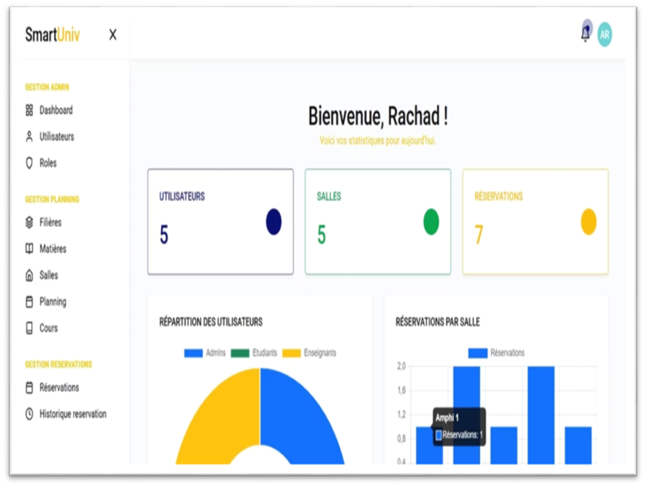
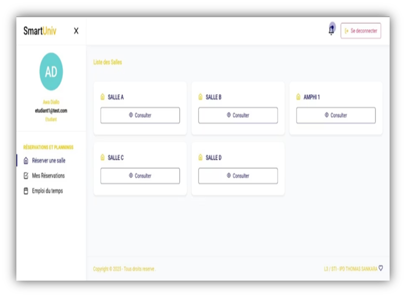

# 🏫 SmartUniv - Système de Gestion des Réservations et des plannings de Salles Universitaires

[](https://laravel.com)
[](https://angular.io)
[](https://php.net)
[](https://mysql.com)
[](LICENSE)

Un système complet de gestion des réservations de salles universitaires avec détection automatique des conflits et rappels intelligents.

## ✨ Fonctionnalités

### 🔍 **Gestion des Conflits de Réservation**
- ✅ Détection automatique des conflits avec le planning officiel
- ✅ Vérification des réservations existantes
- ✅ Prévention des doubles réservations
- ✅ Messages d'erreur détaillés avec informations sur le conflit

### 🔔 **Système de Rappels Automatiques**
- ✅ Rappels 24h avant la réservation
- ✅ Rappels 2h avant la réservation
- ✅ Annulation automatique des réservations expirées
- ✅ Notifications par email et dans l'application

### 👥 **Gestion des Utilisateurs**
- ✅ Authentification JWT
- ✅ Gestion des rôles et permissions
- ✅ Profils utilisateurs complets
- ✅ Recherche et filtrage avancés

### 🏫 **Gestion Académique**
- ✅ Gestion des salles (amphithéâtres, salles de cours, laboratoires)
- ✅ Gestion des filières et classes
- ✅ Gestion des matières et cours
- ✅ Planning officiel intégré

### 📅 **Système de Réservations**
- ✅ Interface intuitive de réservation
- ✅ Validation en temps réel
- ✅ Historique des réservations
- ✅ Statuts : En attente, Validée, Annulée

### 📊 **Tableau de Bord**
- ✅ Statistiques en temps réel
- ✅ Graphiques et métriques
- ✅ Notifications en attente
- ✅ Vue d'ensemble des réservations

## Interfaces

### LoginInterface


### DashboardInterface


### UserInterface


### PlanningInterface


## 🏗️ Architecture

### **Backend (Laravel)**
```
app/
├── Console/Commands/          # Commandes Artisan personnalisées
├── Http/Controllers/          # Contrôleurs API
├── Mail/                      # Templates d'emails
├── Models/                    # Modèles Eloquent
├── Services/                  # Services métier
└── Providers/                 # Fournisseurs de services
```

### **Frontend (Angular)**
```
frontend/src/app/
├── core/                      # Services core (auth, interceptors)
├── models/                    # Interfaces TypeScript
├── services/                  # Services API
├── views/pages/               # Composants des pages
└── shared/                    # Composants partagés
```

### **Base de Données**
- **Utilisateurs** : Gestion des comptes et rôles
- **Salles** : Informations sur les salles disponibles
- **Réservations** : Historique et statuts des réservations
- **Planning** : Planning officiel des cours
- **Notifications** : Système de notifications

## 🚀 Installation

### Prérequis
- PHP 8.2+
- Composer
- Node.js 16+
- MySQL 8.0+
- Git

### Étapes d'Installation

1. **Cloner le repository**
```bash
git clone https://github.com/Rachad-ac/SmartUniv.git
cd app-grsu
```

2. **Installer les dépendances PHP**
```bash
composer install
```

3. **Installer les dépendances Node.js**
```bash
npm install
cd frontend && npm install && cd ..
```

4. **Configuration de l'environnement**
```bash
cp .env.example .env
```

5. **Générer la clé d'application**
```bash
php artisan key:generate
```

6. **Configuration de la base de données**
```bash
# Créer une base de données MySQL nommée 'grsu'
# Puis configurer les variables dans .env :
DB_CONNECTION=mysql
DB_HOST=127.0.0.1
DB_PORT=3306
DB_DATABASE=grsu
DB_USERNAME=votre_username
DB_PASSWORD=votre_password
```

7. **Exécuter les migrations et seeders**
```bash
php artisan migrate
php artisan db:seed
```

8. **Construire les assets frontend**
```bash
npm run build
```

## ⚙️ Configuration

### **Variables d'Environnement (.env)**

```env
# Application
APP_NAME="APP-G.R.S.U"
APP_ENV=local
APP_KEY=base64:your_app_key
APP_DEBUG=true
APP_URL=http://localhost

# Base de données
DB_CONNECTION=mysql
DB_HOST=127.0.0.1
DB_PORT=3306
DB_DATABASE=grsu
DB_USERNAME=root
DB_PASSWORD=

# Mail Configuration
MAIL_MAILER=smtp
MAIL_HOST=smtp.gmail.com
MAIL_PORT=587
MAIL_USERNAME=votre_email@gmail.com
MAIL_PASSWORD=votre_app_password
MAIL_ENCRYPTION=tls
MAIL_FROM_ADDRESS=votre_email@gmail.com
MAIL_FROM_NAME="${APP_NAME}"

# JWT
JWT_SECRET=votre_jwt_secret

# Autres configurations...
```

### **Tâches Programmées (Cron Jobs)**

Ajouter cette ligne au crontab pour les rappels automatiques :
```bash
* * * * * cd /path/to/project && php artisan schedule:run >> /dev/null 2>&1
```

## 📊 Utilisation

### **Démarrage du Serveur de Développement**

1. **Backend Laravel**
```bash
php artisan serve
```

2. **Frontend Angular**
```bash
cd frontend && ng serve
```

3. **Ou utiliser le script de développement intégré**
```bash
composer run dev
```

L'application sera accessible sur :
- **Backend API** : http://localhost:8000
- **Frontend** : http://localhost:4200

### **Comptes de Test**

Après les seeders, les comptes suivants sont disponibles :

| Rôle | Email | Mot de passe |
|------|-------|-------------|
| Administrateur | admin@smartuniv.com | password |
| Enseignant | teacher@smartuniv.com | password |
| Étudiant | student@smartuniv.com | password |

## 🔧 API Documentation

### **Endpoints Principaux**

#### **Authentification**
```http
POST /api/login
POST /api/register
POST /api/logout
GET  /api/user
```

#### **Utilisateurs**
```http
GET    /api/users/all
GET    /api/users/search
GET    /api/users/{id}
PUT    /api/users/{id}
DELETE /api/users/{id}
```

#### **Réservations**
```http
GET    /api/reservations
POST   /api/reservations/reserver
POST   /api/reservations/check-availability
PUT    /api/reservations/{id}
DELETE /api/reservations/{id}
```

#### **Rappels et Conflits**
```http
POST /api/reminders/send-upcoming
POST /api/reminders/cancel-expired
POST /api/reminders/run-all
```

### **Structure des Réponses API**

Toutes les réponses suivent ce format :
```json
{
  "success": true|false,
  "message": "Description de la réponse",
  "data": {}|[],
  "errors": null|{}
}
```

### **Tests de l'API**
```bash
# Tester la détection de conflits
curl -X POST http://localhost:8000/api/reservations/check-availability \
  -H "Content-Type: application/json" \
  -d '{"id_salle":1,"date_debut":"2024-01-15 09:00:00","date_fin":"2024-01-15 11:00:00"}'
```

## 📈 Déploiement

### **Préparation pour la Production**

1. **Optimisation**
```bash
php artisan config:cache
php artisan route:cache
php artisan view:cache
composer install --optimize-autoloader --no-dev
```

2. **Build Frontend**
```bash
npm run build --prod
```

3. **Configuration Serveur**
```bash
# Permissions
chown -R www-data:www-data storage
chown -R www-data:www-data bootstrap/cache
chmod -R 755 storage
chmod -R 755 bootstrap/cache

# Tâches programmées
crontab -e
# Ajouter : * * * * * cd /path/to/project && php artisan schedule:run >> /dev/null 2>&1
```

## 🤝 Contribution

1. Fork le projet
2. Créer une branche feature (`git checkout -b feature/AmazingFeature`)
3. Commit les changements (`git commit -m 'Add some AmazingFeature'`)
4. Push vers la branche (`git push origin feature/AmazingFeature`)
5. Ouvrir une Pull Request

### **Standards de Code**
- PSR-12 pour PHP
- Angular Style Guide pour TypeScript
- Commits conventionnels

## 📄 Licence

Ce projet est sous licence MIT.

## 👥 Équipe

- **Développeur Principal** : Ahmed Combo Rachad
- **Email** : ahmedcomborachad@gmail.com
- **LinkedIn** : www.linkedin.com/in/ahmed-combo-rachad-385b5b302

---

**⭐ Si ce projet vous plaît, n'hésitez pas à lui donner une étoile !**

Pour plus d'informations, contactez l'équipe de développement.
